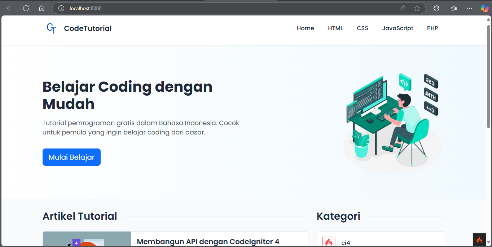
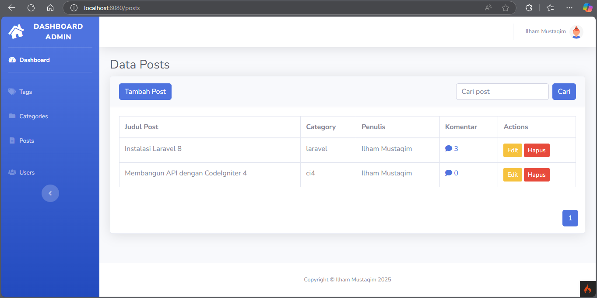

# Code Tutorial - CMS Artikel dengan CodeIgniter 4
Code Tutorial adalah sebuah CMS berbasis web yang memungkinkan pengguna untuk membaca dan mengelola artikel secara efisien. Proyek ini dirancang menggunakan framework [CodeIgniter 4](https://codeigniter.com/) dan [Bootstrap](https://getbootstrap.com/) untuk tampilan antarmuka.






## Fitur

- **Manajemen Artikel**: Tambah, edit, hapus, dan lihat daftar artikel.
- **Kategori**: Pengelompokan artikel berdasarkan kategori.
- **Pencarian**: Fitur pencarian artikel berdasarkan judul atau konten.
- **Responsif**: Desain antarmuka yang responsif berkat integrasi dengan Bootstrap.

## Teknologi
- **Framework**: CodeIgniter 4
- **Frontend**: Bootstrap
- **Database**: MySQL
- **Lainnya**: PHP, JavaScript, jQuery

## Persyaratan Sistem

- **Web Server**: Apache atau Nginx
- **PHP**: Versi 8.2
- **Database**: MySQL 
- **Composer**: Untuk manajemen dependensi PHP

## Instalasi

Ikuti langkah-langkah berikut untuk menginstal dan menjalankan proyek ini di lingkungan lokal Anda:

1. **Clone Repository**: Clone repository ini ke direktori lokal Anda.
   ```bash
   git clone https://github.com/ilhamust/artikel-cms-ilhamMustaqim.git
   cd artikel-cms-ilhamMustaqim

2. **Konfigurasi lingkungan**
   - Salin file .env.example menjadi .env
   - Atur konfigurasi database di .env
      ```bash
      database.default.hostname = localhost
      database.default.database = cms
      database.default.username = root
      database.default.password =
      database.default.DBDriver = MySQLi
      database.default.DBPrefix =
      database.default.port = 3306
    
  3. **Jalankan Migrasi Database**
     ```bash
     php spark migrate
     
  4. **Jalankan Server Lokal**
     ```bash
     php spark serve
     
  5. **Akses melalui browser**
     ```bash
     http://localhost:8080

  6. **Akses Dashboard**
     - Username : Ilham Mustaqim
     - Password : 1234567
     ```bash
     http://localhost:8080/login

